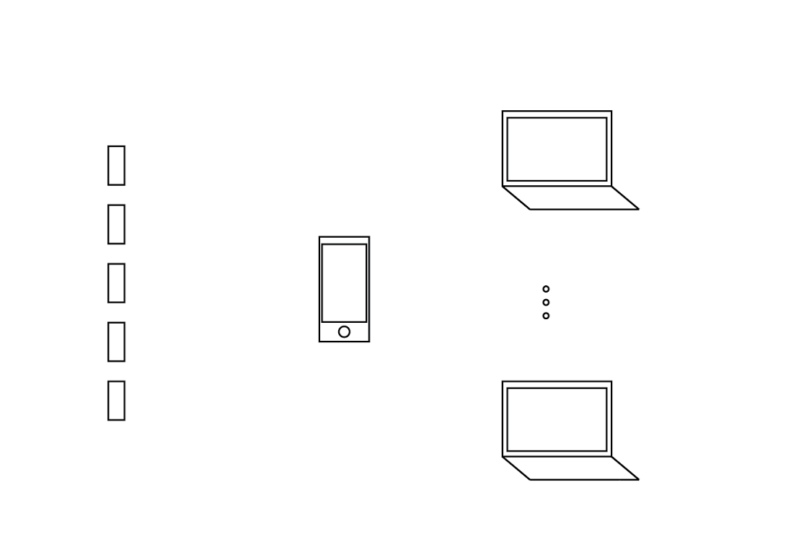

#Designing connected experiences with BLE 


[Workshop destription](http://resonate.io/2015/education/designing-connected-experiences-with-ble/)


## How To Get Started
####Download repository

Git user can follow these steps in the terminal:

- navigate to the location where you want to copy the repository;
- type ```git clone https://github.com/Tellart/Resonate2015.git```


otherwhise just download this repo from github.

####Run the server
######Mac OS X 
- Navigate to client connector ```cd Resonate2015/clientConnector```
- Start the webserver with the command: ```python -m SimpleHTTPServer 8000```
- Open your browser and go to the url ```http://localhost:8000/sample/``` to check that is working.

In the folder clientConnector you can duplicate the _sample_ folder and rename it as you like. 

Open your browser and go to the url ```http://localhost:8000/yourname/```.


The server is not necessary but just nice to have, you can directly open _index.html_ located in the sample folder or the duplicate of it.

 

## Reference
<p align="center" >
  
</p>


### __`connector` object__

The gem object is a singleton that abstract the controller of the ble modules. 
To retrieve the object call `getInstance` on connector.

```javascript
connector.getInstance()
```


##### Attributes

`status`  _INIT_, _OPENED_, _RUNNING_, _CLOSED_, _ERROR_

```javascript
if(connector.getInstance().status=="OPENED")
{
	background(12,255,23);
}

```


`boardNumber` -1 until instantiated, then 0-5

`buttonState` true is pressed, false is up

`buttonRegistered` true or false

`temperatureRegistered` true or false

`temperature` eg 24.25

`freeFallRegistered` true or false

`freeFall` true if in free fall

`tapRegistered` true or false

`tap` true if tap is sensed

`shakeRegistered` true or false

`shaked` true if shake is sensed

`orientationRegistered` true or false

`orientation` "Portrait","PortraitUpsideDown","LandscapeLeft","LandscapeRight"

`rssi` signal strength, negative integer with closer to 0 = closer to connector

`batteryLevel` 0 to 100

##### Methods
__utility methods__  
 
`setupSocket()` 					 start the communication with the connector on default address;  
`setupSocket(socketAddress)`   start the communication with a socket address in the form `"192.168.1.17:9092"` (the server is receiving on port 9092)  

__actuator methods__   
`setColor(deviceNumber,red,green,blue,intensity)` set the color the led of one board. _deviceNumber_ is an integer between 0 and 4, the components _red_, _green_, _blue_ and _intensity_ are integers between 0 and 255

`makeVibrate(deviceNumber)` _deviceNumber_ is an integer between 0 and 5, it will create a vibration
`makeVibrateWithOptions(length,amplitude,deviceNumber)` length is an integer in ms between 0 and 5000, amplitude is 0 to 255

__sensor methods__ 

Sensors are organized with an observer pattern logic. 
You can register to observe a sensor, when done you can release it.

`registerButton`  
`releaseButton`  

`registerTemperature`  
`release Temperature`

`registerShake`  
`releaseShake`

`registerFreeFall`  
`releaseFreeFall`

`registerOrientation`  
`releaseOrientation`

`registerTap`  
`releaseTap`


### global methods

`initDevice(deviceNumber)` 

`shaked()`

`tapped()`

`orientationChanged(deviceOrientation)`

`isFalling()`

`buttonPressed()`


